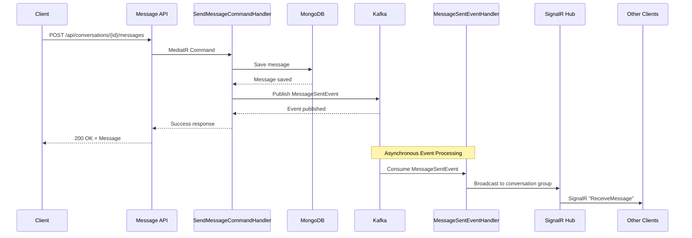

# Event-Driven Messaging Architecture

## 📋 Overview

MessageService đã được thiết kế theo **Event-Driven Architecture** để đảm bảo tính decoupling, reliability và scalability.

### Architectural Pattern

```
Client → REST API → MongoDB → Kafka Event → SignalR Broadcast
```

## 🔄 Message Flow

### 1. Send Message (Event-Driven Flow)



### 2. Component Responsibilities

#### **REST API Layer (Message.API)**
- **Controllers**: Nhận HTTP requests từ clients
- **Purpose**: Entry point cho tất cả messaging operations
- **Response**: Trả về response ngay sau khi save to database (không chờ SignalR)

#### **Command Handler (SendMessageCommandHandler)**
```csharp
public async Task<MessageDto> Handle(SendMessageCommand request, ...)
{
    // 1. Validate conversation exists
    // 2. Save message to MongoDB
    var message = await _messageRepository.AddAsync(chatMessage, cancellationToken);
    
    // 3. Publish event to Kafka
    await _eventBus.PublishAsync(new MessageSentEvent
    {
        MessageId = message.Id,
        ConversationId = message.ConversationId,
        // ... event data
    });
    
    return messageDto; // Return immediately
}
```

#### **Kafka Event Bus**
- **Topic**: `MessageSentEvent`
- **Producer**: `SendMessageCommandHandler`
- **Consumer**: `MessageSentEventHandler`
- **Purpose**: Decoupling message persistence from real-time broadcast

#### **Event Handler (MessageSentEventHandler)**
```csharp
public async Task HandleAsync(MessageSentEvent @event, ...)
{
    // Consume event from Kafka
    await _hubContext.Clients
        .Group(@event.ConversationId)
        .SendAsync("ReceiveMessage", @event.MessageData);
}
```

#### **SignalR Hub (ChatHub)**
- **Purpose**: Real-time communication only
- **Responsibilities**:
  - Connection management (Join/Leave conversation)
  - Typing indicators
  - Read receipts
  - Online/Offline status
- **NOT responsible for**: Sending messages (handled by event handler)

## 🎯 Benefits

### 1. **Decoupling**
- API layer không phụ thuộc vào SignalR
- Có thể thay đổi real-time mechanism (WebSockets, gRPC, etc.) mà không ảnh hưởng API
- Business logic (save message) tách biệt khỏi delivery mechanism (broadcast)

### 2. **Reliability**
- Kafka đảm bảo message delivery (at-least-once)
- Nếu SignalR server down, event vẫn được lưu trong Kafka
- Có thể replay events để recover state

### 3. **Scalability**
- Có thể scale API servers và SignalR servers độc lập
- Multiple consumers có thể process cùng một event
- Load balancing dễ dàng hơn

### 4. **Auditability**
- Tất cả events được log trong Kafka
- Có thể track message flow từ API → Kafka → SignalR
- Debug issues dễ dàng hơn

### 5. **Extensibility**
- Dễ dàng thêm consumers mới cho cùng event:
  - Push notification service
  - Analytics service
  - Email notification
  - Audit logging
  - External integrations

## 🔧 Configuration

### appsettings.json

```json
{
  "KafkaSettings": {
    "BootstrapServers": "localhost:9092",
    "GroupId": "message-service-group",
    "ClientId": "message-service",
    "AutoOffsetReset": "earliest",
    "EnableAutoCommit": true
  },
  "MongoDbSettings": {
    "ConnectionString": "mongodb://localhost:27017",
    "DatabaseName": "EMIS_MessageDB"
  }
}
```

### Program.cs - Event Registration

```csharp
// Register EventBus
builder.Services.AddKafkaEventBus(builder.Configuration);

// Register Event Handlers
builder.Services.AddEventHandler<MessageSentEvent, MessageSentEventHandler>();
builder.Services.AddEventHandler<StudentAssignedToClassEvent, StudentAssignedToClassEventHandler>();
builder.Services.AddEventHandler<TeacherAssignedToClassEvent, TeacherAssignedToClassEventHandler>();

// Add Kafka Consumer
builder.Services.AddKafkaConsumer(consumer =>
{
    consumer.RegisterEventType<MessageSentEvent>(nameof(MessageSentEvent));
    consumer.RegisterEventType<StudentAssignedToClassEvent>(nameof(StudentAssignedToClassEvent));
    consumer.RegisterEventType<TeacherAssignedToClassEvent>(nameof(TeacherAssignedToClassEvent));
});
```

## 📊 Event Schema

### MessageSentEvent

```csharp
public class MessageSentEvent : BaseEvent
{
    public override string EventType => nameof(MessageSentEvent);
    
    public string MessageId { get; set; }
    public string ConversationId { get; set; }
    public string SenderId { get; set; }
    public UserType SenderType { get; set; }
    public string Content { get; set; }
    public DateTime SentAt { get; set; }
    
    // Full message DTO for broadcasting
    public MessageDto MessageData { get; set; }
}
```

## 🧪 Testing

### 1. Start Infrastructure

```bash
# Start MongoDB + Kafka
docker-compose up -d mongodb kafka zookeeper
```

### 2. Run Message Service

```bash
dotnet run --project src/Services/MessageService/Message.API
```

### 3. Test Event Flow

#### A. Send Message via REST API
```http
POST http://localhost:5005/api/conversations/{conversationId}/messages
Content-Type: application/json

{
  "senderId": "parent-001",
  "senderType": "Parent",
  "content": "Hello teacher!"
}
```

**Expected Flow:**
1. ✅ API returns 200 OK immediately
2. ✅ Message saved to MongoDB
3. ✅ MessageSentEvent published to Kafka
4. ✅ MessageSentEventHandler consumes event
5. ✅ SignalR broadcasts to all clients in conversation

#### B. Monitor Kafka Events

```bash
# List topics
docker exec -it kafka kafka-topics --list --bootstrap-server localhost:9092

# Consume MessageSentEvent topic
docker exec -it kafka kafka-console-consumer \
  --bootstrap-server localhost:9092 \
  --topic MessageSentEvent \
  --from-beginning
```

#### C. SignalR Client Test

```javascript
const connection = new signalR.HubConnectionBuilder()
    .withUrl("http://localhost:5005/chathub")
    .build();

// Join conversation
await connection.invoke("JoinConversation", conversationId);

// Listen for new messages
connection.on("ReceiveMessage", (message) => {
    console.log("📨 New message via SignalR:", message);
});

await connection.start();
```

## 🚀 Performance Considerations

### 1. API Response Time
- API returns immediately after MongoDB save (~10-50ms)
- Does NOT wait for Kafka publish or SignalR broadcast
- Kafka publish is fire-and-forget (async)

### 2. Event Processing
- Kafka consumers run in background (BackgroundService)
- Multiple consumers can process events in parallel
- Consumer offset management ensures exactly-once processing

### 3. SignalR Scaling
- Use Redis backplane for multi-server SignalR:
```csharp
builder.Services.AddSignalR()
    .AddStackExchangeRedis("localhost:6379");
```

## 🔒 Error Handling

### 1. Kafka Publish Failure
```csharp
try
{
    await _eventBus.PublishAsync(messageEvent);
}
catch (Exception ex)
{
    _logger.LogError(ex, "Failed to publish MessageSentEvent");
    // Message already saved to DB
    // TODO: Implement dead-letter queue or retry logic
}
```

### 2. Event Processing Failure
```csharp
catch (Exception ex)
{
    _logger.LogError(ex, "Failed to broadcast message via SignalR");
    throw; // Kafka will retry based on consumer config
}
```

### 3. MongoDB Failure
- API returns 500 error
- Event is NOT published (transaction-like behavior)
- Client can retry request

## 📈 Monitoring

### Key Metrics to Track

1. **API Performance**
   - Message creation latency
   - Kafka publish success rate
   - MongoDB write performance

2. **Event Processing**
   - Kafka consumer lag
   - Event processing time
   - SignalR broadcast success rate

3. **SignalR Health**
   - Active connections count
   - Message delivery rate
   - Connection failures

### Logging

```csharp
// SendMessageCommandHandler
_logger.LogInformation("Message {MessageId} saved to DB and published to Kafka");

// MessageSentEventHandler
_logger.LogInformation("Broadcasting message {MessageId} to conversation {ConversationId} via SignalR");
```

## 🔄 Future Enhancements

### 1. Multiple Consumers for Same Event
```csharp
// Consumer 1: SignalR broadcast
MessageSentEvent → MessageSentEventHandler → SignalR

// Consumer 2: Push notifications
MessageSentEvent → PushNotificationHandler → FCM/APNs

// Consumer 3: Analytics
MessageSentEvent → AnalyticsHandler → Elasticsearch

// Consumer 4: Email notifications (offline users)
MessageSentEvent → EmailNotificationHandler → SMTP
```

### 2. Event Sourcing
- Store all events in event store
- Rebuild conversation state from events
- Time-travel debugging

### 3. CQRS Enhancement
- Separate read/write models
- Optimized read model for queries
- Event-driven projection updates

## 📚 Related Documentation

- [MESSAGE_SERVICE_GUIDE.md](./MESSAGE_SERVICE_GUIDE.md) - General messaging guide
- [EVENTBUS_ARCHITECTURE.md](./EVENTBUS_ARCHITECTURE.md) - EventBus implementation
- [KAFKA_TOPIC_STRATEGY.md](./KAFKA_TOPIC_STRATEGY.md) - Kafka configuration

## 🎓 Summary

**Event-Driven Architecture** cho phép MessageService:
- ✅ Decouple business logic khỏi delivery mechanism
- ✅ Đảm bảo message reliability qua Kafka
- ✅ Scale horizontally dễ dàng
- ✅ Mở rộng với multiple consumers
- ✅ Audit và debug hiệu quả

**Trade-offs:**
- ⚠️ Increased complexity (thêm Kafka infrastructure)
- ⚠️ Eventual consistency (SignalR broadcast có thể delay vài ms)
- ⚠️ Cần monitor Kafka consumer lag

**Recommendation:** Sử dụng pattern này cho production systems cần high scalability và reliability.
